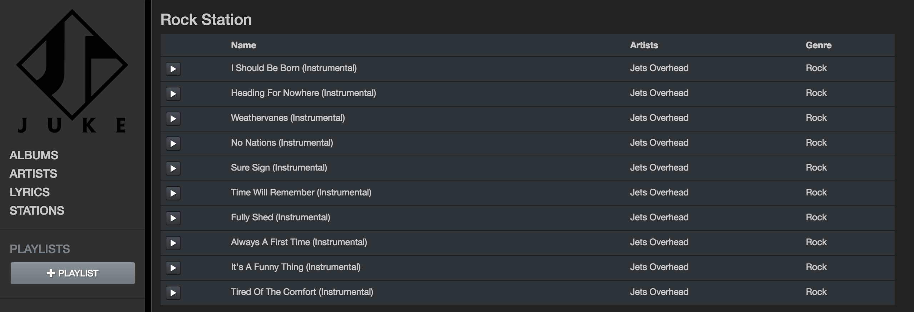

# Juke

### Plataforma de streaming de música

Desarrollada en React + Redux, utilizando herramientas como Axios, Babel, Bootstrap, Webpack, para el front-end.

Node, Express, PostgreSQL, Sequelize, Body-parser, para el back-end.

